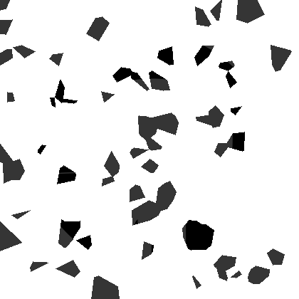
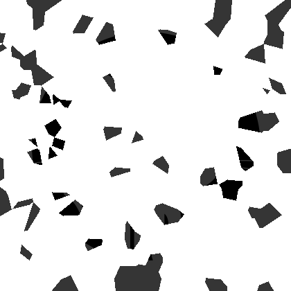
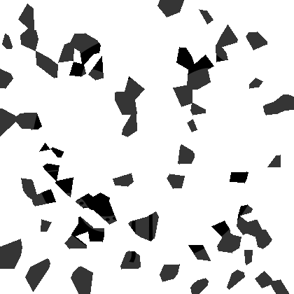
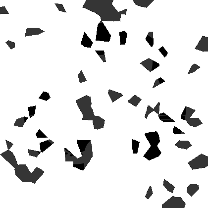
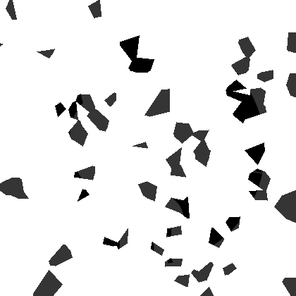
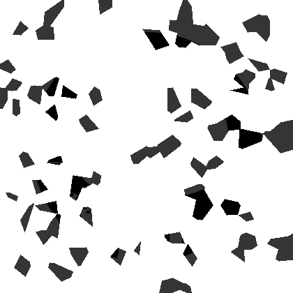
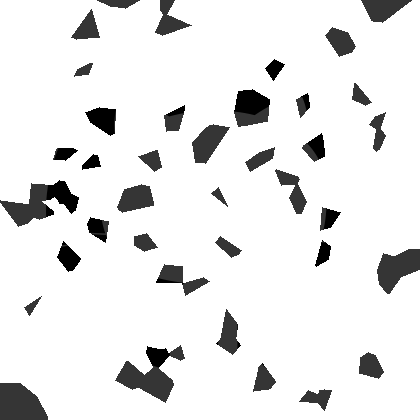

# ImageBreaker - 图片碎纸机 🧨

一个图片分割的代码，支持将图片“碎纸化”或将多张碎片图片重新合并为一张图片。界面使用 `tkinter` + `sv_ttk` 实现，支持深色主题，配有进度条、预览图像等功能。

---

## ✨ 功能特点

- 🧩 **图片拆分**：使用 Voronoi 图算法将图片随机打碎为若干块。
- 🖼️ **图像合并**：将若干张透明图层重叠合并为一张图片。

---

## 📦 安装依赖

请确保你使用的是 Python 3.8+，并在项目根目录执行以下命令安装依赖：

```bash
pip install -r requirements.txt
```

---

## 🚀 使用方法

```bash
python ImageBreaker.py
```

运行后会弹出图形界面，选择“拆分图像”或“合并图像”模式，即可开始使用。

---

### 🪟 方法二：直接运行打包好的 Windows 程序

> 📦 无需 Python 环境，下载即用：

1. 访问 [Releases 页面](https://github.com/GoldenWaL/ImageBreaker/releases)
2. 下载最新版压缩包（如 `ImageBreaker-Windows.zip`），解压后双击运行 `ImageBreaker.exe`

---

#### ⚠️ 高分屏下字体过小怎么办？

1. 右键 `ImageBreaker.exe` → 属性 → **兼容性**
2. 点击 **更改高 DPI 设置**
3. 勾选 **高 DPI 缩放替代** → 选择 **系统（增强）**
4. 点击确定并重新运行程序，字体即正常

---

## 🛠️ 项目结构

- `ImageBreaker.py`：主程序文件，包含完整 GUI 与处理逻辑。
- `requirements.txt`：依赖库清单。

---

## 🧠 使用算法简介

- 使用 `Voronoi` 图对图像随机生成多边形切割区域。
- 每块区域图像使用 mask 蒙版抽取后分配到多个画布。
- 合并时，处理透明背景、颜色反转等选项，并自动融合所有图层。

---

## 📸 示例图（500块，拆分为8张）

### 🔹 拆分前

> 原始图像如下：


---

### 🔸 拆分后（生成的 8 张图像）

> 每张图像为 Voronoi 区域随机分配结果的一部分：

|  |  |  |  |
|:--:|:--:|:--:|:--:|
|  |  |  |  |


---

## 📄 License

本项目遵循 MIT 协议自由发布和使用。
